---
## Front matter
lang: ru-RU
title: Лабораторная работа №3
subtitle: Основы информационной безопасности 
author:
  - Галиева Аделина Руслановна
institute:
  - Российский университет дружбы народов, Москва, Россия
date: 14 марта 2024

## i18n babel
babel-lang: russian
babel-otherlangs: english

## Formatting pdf
toc: false
toc-title: Содержание
slide_level: 2
aspectratio: 169
section-titles: true
theme: metropolis
header-includes:
 - \metroset{progressbar=frametitle,sectionpage=progressbar,numbering=fraction}
 - '\makeatletter'
 - '\beamer@ignorenonframefalse'
 - '\makeatother'
---

# Вводная часть

## Цели и задачи

Получение практических навыков работы в консоли с атрибутами файлов для групп пользователей.

## Материалы и методы

- Процессор `pandoc` для входного формата Markdown
- Результирующие форматы
	- `pdf`
	- `html`
- Автоматизация процесса создания: `Makefile`

# Создание презентации

## Процессор `pandoc`

- Pandoc: преобразователь текстовых файлов
- Сайт: <https://pandoc.org/>
- Репозиторий: <https://github.com/jgm/pandoc>

## Формат `pdf`

- Использование LaTeX
- Пакет для презентации: [beamer](https://ctan.org/pkg/beamer)
- Тема оформления: `metropolis`

## Код для формата `pdf`

```yaml
slide_level: 2
aspectratio: 169
section-titles: true
theme: metropolis
```

## Формат `html`

- Используется фреймворк [reveal.js](https://revealjs.com/)
- Используется [тема](https://revealjs.com/themes/) `beige`

## Код для формата `html`

- Тема задаётся в файле `Makefile`

```make
REVEALJS_THEME = beige 
```
# Результаты

## Содержание исследования

1. В прошлой лабораторной работе мы уже создавали учетную запись пользователя guest. 

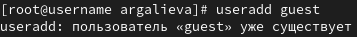{#fig:001 width=95%}

##

2. Также задавали пароль для пользователя guest. 

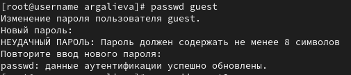{#fig:002 width=95%}

##

3. Создаем второго пользователя guest2 и задаем ему пароль. 

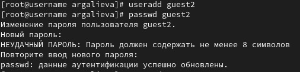{#fig:003 width=95%}

##

4. Добавляем пользователя guest2 в группу guest. 

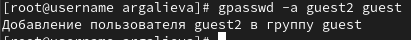{#fig:004 width=95%}

##

5. Выполняем вход в две учетные записи guest и guest2 на разных консолях. Для двух пользователей командой pwd определили директорию, в которой находимся. Сравнили её с приглашением командной строки. Уточняем имя нашего пользователя, его группу, кто входит в неё и к каким группам принадлежит он сам. Определяем командами groups guest и groups guest2, в какие группы входят пользователи guest и guest2. Сравниваем вывод команды groups с выводом команд
id -Gn и id -G.

##

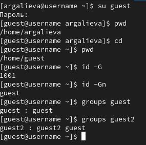{#fig:005 width=95%}

##

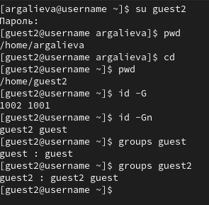{#fig:006 width=95%}

##

6. Сравниваем полученную информацию с содержимым файла /etc/group. Просматриваем файл командой cat /etc/group.

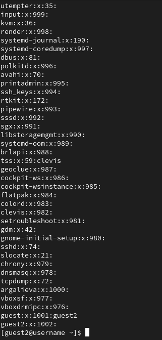{#fig:007 width=95%}

##

7. От имени пользователя guest2 выполняем регистрацию пользователя guest2 в группе guest командой newgrp guest. 

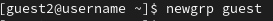{#fig:008 width=95%}

##

8. От имени пользователя guest меняем права директории /home/guest, разрешив все действия для пользователей группы: chmod g+rwx /home/guest. От имени пользователя guest снимаем с директории /home/guest/dir1 все атрибуты командой chmod 000 dir1 и проверяем правильность снятия атрибутов. 

##

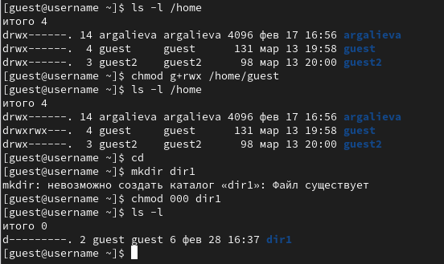{#fig:009 width=95%}

##

9. Меняя атрибуты у директории dir1 и файла file1 от имени пользователя guest и делая проверку от пользователя guest2, заполняем таблицу, определив опытным путём, какие операции разрешены, а какие нет. Если операция разрешена, заносим в таблицу знак «+», если не разрешена, знак «-». Сравниваем таблицы со второй лабораторной работы №2. На основании заполненной таблицы определяем те или иные минимально необходимые права для выполнения пользователем guest2 операций внутри директории dir1 и заполняем другую таблицу. Обозначения в таблице: (1) - Создание файла, (2) - Удаление файла, (3) - Запись в файл, (4) - Чтение файла, (5) - Смена директории, (6) - Просмотр файлов в директории, (7) - Переименование файла, (8) - Смена атрибутов файла. 

##

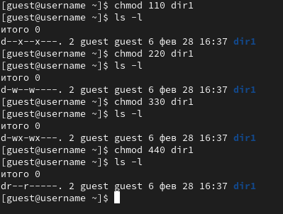{#fig:010 width=95%}

##

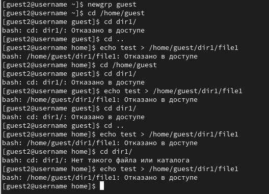{#fig:011 width=95%}

##

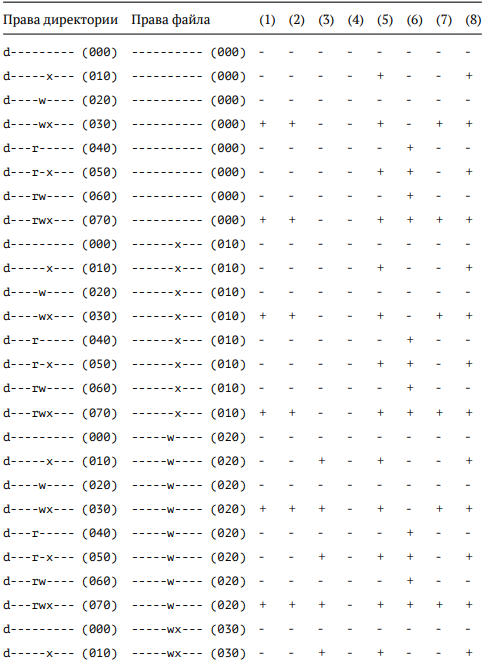{#fig:012 width=95%}

##

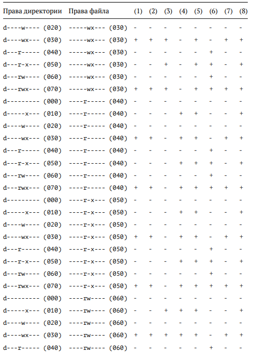{#fig:013 width=95%}

##

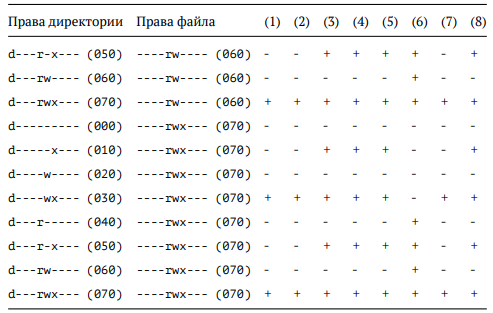{#fig:014 width=95%}

##

10. На основании заполненной таблицы я определила те или иные минимально необходимые права для выполнения пользователем guest2 операций внутри директории dir1 и заполнила таблицу. Для заполнения последних двух строк опытным путем проверила минимальные права для создания и удаления поддиректории. 

##

{#fig:015 width=95%}

##

11. Сравнивая таблицы с такой же таблицей из предыдущей лабораторной работы, могу сказать, что они одинаковы. Единственное различие только в том, что в предыдущей лабораторной работе я присваивала права владельцу, в этот раз группе. 


## Результаты

В ходе выполнения лабораторной работы, я приобрела практические навыки работы в консоли с атрибутами файлов для групп пользователей. 


