---
## Front matter
title: "Лабораторная работа №3"
subtitle: "Дискреционное разграничение прав в Linux. Два пользователя"
author: "Галиева Аделина Руслановна"

## Generic otions
lang: ru-RU
toc-title: "Содержание"

## Bibliography
bibliography: bib/cite.bib
csl: pandoc/csl/gost-r-7-0-5-2008-numeric.csl

## Pdf output format
toc: true # Table of contents
toc-depth: 2
lof: true # List of figures
lot: true # List of tables
fontsize: 12pt
linestretch: 1.5
papersize: a4
documentclass: scrreprt
## I18n polyglossia
polyglossia-lang:
  name: russian
  options:
	- spelling=modern
	- babelshorthands=true
polyglossia-otherlangs:
  name: english
## I18n babel
babel-lang: russian
babel-otherlangs: english
## Fonts
mainfont: PT Serif
romanfont: PT Serif
sansfont: PT Sans
monofont: PT Mono
mainfontoptions: Ligatures=TeX
romanfontoptions: Ligatures=TeX
sansfontoptions: Ligatures=TeX,Scale=MatchLowercase
monofontoptions: Scale=MatchLowercase,Scale=0.9
## Biblatex
biblatex: true
biblio-style: "gost-numeric"
biblatexoptions:
  - parentracker=true
  - backend=biber
  - hyperref=auto
  - language=auto
  - autolang=other*
  - citestyle=gost-numeric
## Pandoc-crossref LaTeX customization
figureTitle: "Рис."
tableTitle: "Таблица"
listingTitle: "Листинг"
lofTitle: "Список иллюстраций"
lotTitle: "Список таблиц"
lolTitle: "Листинги"
## Misc options
indent: true
header-includes:
  - \usepackage{indentfirst}
  - \usepackage{float} # keep figures where there are in the text
  - \floatplacement{figure}{H} # keep figures where there are in the text
---

# Цель работы

Получение практических навыков работы в консоли с атрибутами файлов для групп пользователей.

# Выполнение лабораторной работы

1. В прошлой лабораторной работе мы уже создавали учетную запись пользователя guest. 

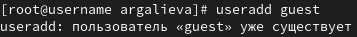{#fig:001 width=95%}

2. Также задавали пароль для пользователя guest. 

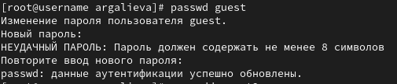{#fig:002 width=95%}

3. Создаем второго пользователя guest2 и задаем ему пароль. 

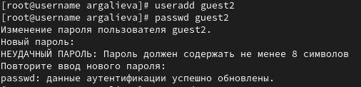{#fig:003 width=95%}

4. Добавляем пользователя guest2 в группу guest. 

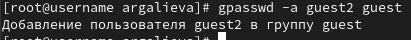{#fig:004 width=95%}

5. Выполняем вход в две учетные записи guest и guest2 на разных консолях. Для двух пользователей командой pwd определили директорию, в которой находимся. Сравнили её с приглашением командной строки. Уточняем имя нашего пользователя, его группу, кто входит в неё и к каким группам принадлежит он сам. Определяем командами groups guest и groups guest2, в какие группы входят пользователи guest и guest2. Сравниваем вывод команды groups с выводом команд
id -Gn и id -G.

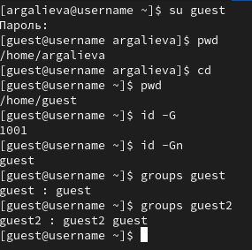{#fig:005 width=95%}

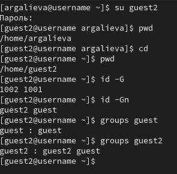{#fig:006 width=95%}

6. Сравниваем полученную информацию с содержимым файла /etc/group. Просматриваем файл командой cat /etc/group.

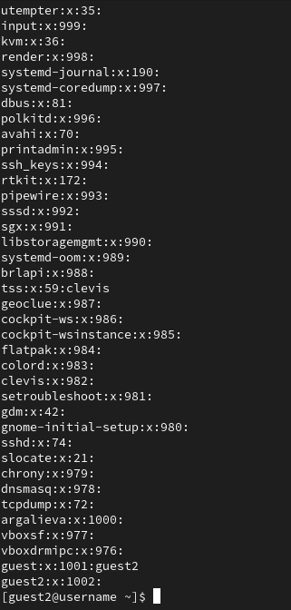{#fig:007 width=95%}

7. От имени пользователя guest2 выполняем регистрацию пользователя guest2 в группе guest командой newgrp guest. 

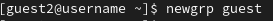{#fig:008 width=95%}

8. От имени пользователя guest меняем права директории /home/guest, разрешив все действия для пользователей группы: chmod g+rwx /home/guest. От имени пользователя guest снимаем с директории /home/guest/dir1 все атрибуты командой chmod 000 dir1 и проверяем правильность снятия атрибутов. 

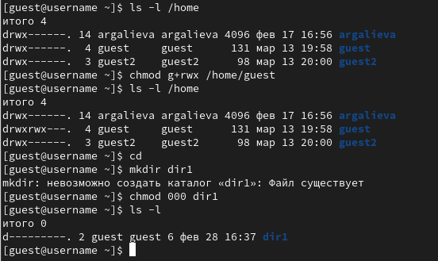{#fig:009 width=95%}

9. Меняя атрибуты у директории dir1 и файла file1 от имени пользователя guest и делая проверку от пользователя guest2, заполняем таблицу, определив опытным путём, какие операции разрешены, а какие нет. Если операция разрешена, заносим в таблицу знак «+», если не разрешена, знак «-». Сравниваем таблицы со второй лабораторной работы №2. На основании заполненной таблицы определяем те или иные минимально необходимые права для выполнения пользователем guest2 операций внутри директории dir1 и заполняем другую таблицу. Обозначения в таблице: (1) - Создание файла, (2) - Удаление файла, (3) - Запись в файл, (4) - Чтение файла, (5) - Смена директории, (6) - Просмотр файлов в директории, (7) - Переименование файла, (8) - Смена атрибутов файла. 

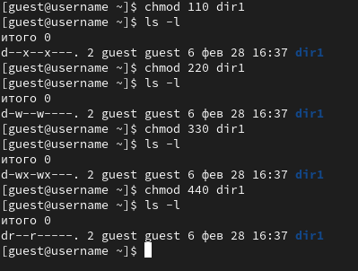{#fig:010 width=95%}

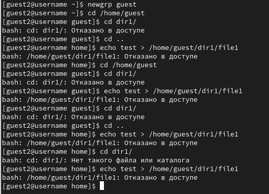{#fig:011 width=95%}

{#fig:012 width=95%}

{#fig:013 width=95%}

{#fig:014 width=95%}

10. На основании заполненной таблицы я определила те или иные минимально необходимые права для выполнения пользователем guest2 операций внутри директории dir1 и заполнила таблицу. Для заполнения последних двух строк опытным путем проверила минимальные права для создания и удаления поддиректории. 

{#fig:015 width=95%}

11. Сравнивая таблицы с такой же таблицей из предыдущей лабораторной работы, могу сказать, что они одинаковы. Единственное различие только в том, что в предыдущей лабораторной работе я присваивала права владельцу, в этот раз группе. 

# Выводы

В ходе выполнения лабораторной работы, я приобрела практические навыки работы в консоли с атрибутами файлов для групп пользователей. 

