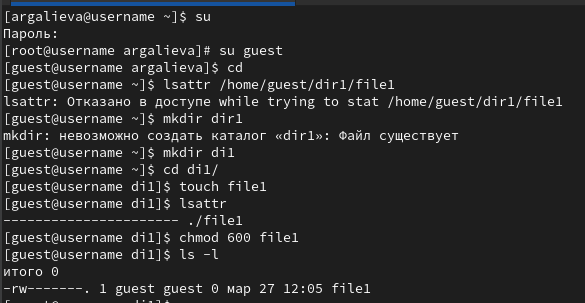
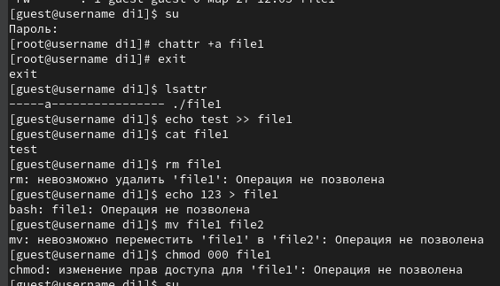
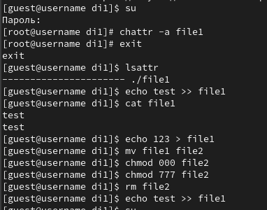
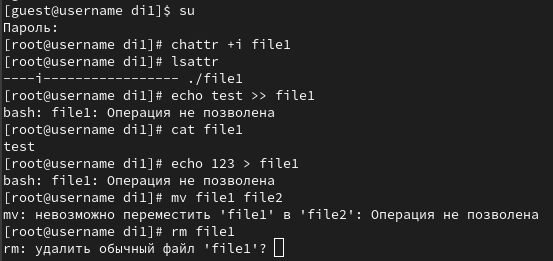

---
## Front matter
title: "Лабораторная работа №4"
subtitle: "Дискреционное разграничение прав в Linux. Расширенные атрибуты."
author: "Галиева Аделина Руслановна"

## Generic otions
lang: ru-RU
toc-title: "Содержание"

## Bibliography
bibliography: bib/cite.bib
csl: pandoc/csl/gost-r-7-0-5-2008-numeric.csl

## Pdf output format
toc: true # Table of contents
toc-depth: 2
lof: true # List of figures
lot: true # List of tables
fontsize: 12pt
linestretch: 1.5
papersize: a4
documentclass: scrreprt
## I18n polyglossia
polyglossia-lang:
  name: russian
  options:
	- spelling=modern
	- babelshorthands=true
polyglossia-otherlangs:
  name: english
## I18n babel
babel-lang: russian
babel-otherlangs: english
## Fonts
mainfont: PT Serif
romanfont: PT Serif
sansfont: PT Sans
monofont: PT Mono
mainfontoptions: Ligatures=TeX
romanfontoptions: Ligatures=TeX
sansfontoptions: Ligatures=TeX,Scale=MatchLowercase
monofontoptions: Scale=MatchLowercase,Scale=0.9
## Biblatex
biblatex: true
biblio-style: "gost-numeric"
biblatexoptions:
  - parentracker=true
  - backend=biber
  - hyperref=auto
  - language=auto
  - autolang=other*
  - citestyle=gost-numeric
## Pandoc-crossref LaTeX customization
figureTitle: "Рис."
tableTitle: "Таблица"
listingTitle: "Листинг"
lofTitle: "Список иллюстраций"
lotTitle: "Список таблиц"
lolTitle: "Листинги"
## Misc options
indent: true
header-includes:
  - \usepackage{indentfirst}
  - \usepackage{float} # keep figures where there are in the text
  - \floatplacement{figure}{H} # keep figures where there are in the text
---

# Цель работы

Получение практических навыков работы в консоли с расширенными атрибутами файлов.

# Выполнение лабораторной работы

1. От имени пользователя guest определяем расширенные атрибуты файла /home/guest/dir1/file1 командой lsattr /home/guest/dir1/file1.

2. Установим командой chmod 600 file1 на файл file1 права, разрешающие чтение и запись для владельца файла.

{#fig:001 width=95%}

3. Пробуем установить на файл /home/guest/dir1/file1 расширенный атрибут a от имени пользователя guest: 
chattr +a /home/guest/dir1/file1. В ответ вы должны получить отказ от выполнения операции. Получаем отказ, для смены расширенных атрибутов недостаточно прав. 

4. Зайдем на третью консоль с правами администратора либо повышаем свои права с помощью команды su. Попробуем установить расширенный атрибут a на файл /home/guest/dir1/file1 от имени суперпользователя:
chattr +a /home/guest/dir1/file1. Команда выполнилась от имени пользователя. 

5. От пользователя guest проверяем правильность установления атрибута: lsattr /home/guest/dir1/file1. Атрибут -а установлен. 

6. Выполняем дозапись в файл file1 слова «test» командой echo "test" /home/guest/dir1/file1. Дозапись выполнена.  После этого выполняем чтение файла file1 командой cat /home/guest/dir1/file1. Убеждаемся, что слово test было успешно записано в file1. 

7. Пробуем удалить файл file1 либо стереть имеющуюся в нём информацию командой echo "abcd" > /home/guest/dirl/file1.
Пробуем переименовать файл. Перезаписать файл не удается, удалить или переименовать тоже. 

8. Пробуем с помощью команды сhmod 000 file1 устанавливаем на файл file1 права, например, запрещающие чтение и за-
пись для владельца файла. Удалось ли вам успешно выполнить указанные команды? Команда изменения прав также не выполняется. 

{#fig:002 width=95%}

9. Снимаем расширенный атрибут a с файла /home/guest/dirl/file1 от имени суперпользователя командой chattr -a /home/guest/dir1/file1. Атрибут снят. Повторяем операции, которые нам ранее не удавалось выполнить. После снятия атрибута -а стало возможным переписать файл, удалить или переименовать его, а также сменить права. Атрибут -а позволяет только дозаписывать файл. 

{#fig:003 width=95%}

10. Повторяем наши действия по шагам, заменив атрибут «a» атрибутом «i». Удалось ли вам дозаписать информацию в файл? Атрибут -i запрещает любое изменение файла: дозапись. переименование, удаление, смена атрибутов. 

{#fig:004 width=95%}

# Выводы

Я получила практические навыки работы в консоли с расширенными атрибутами файлов.

