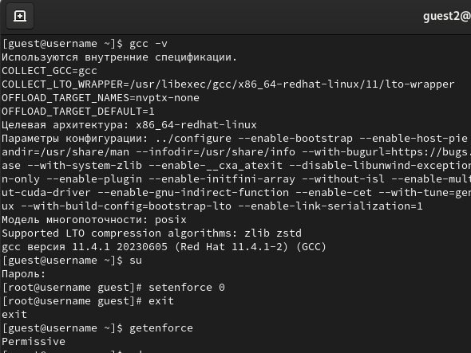
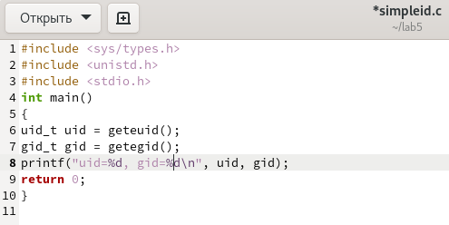
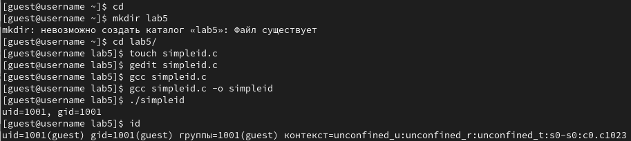
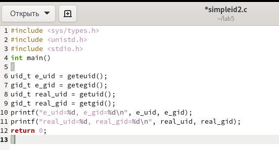
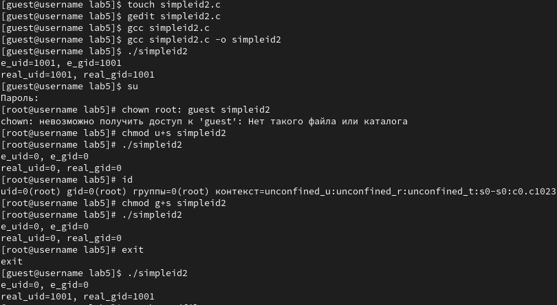
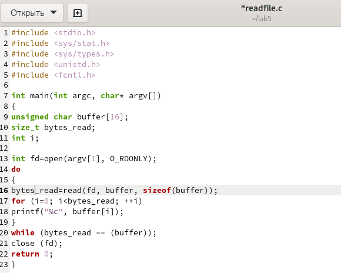
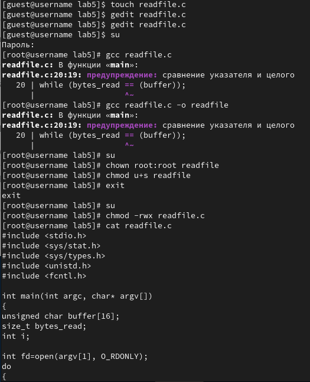
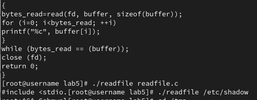
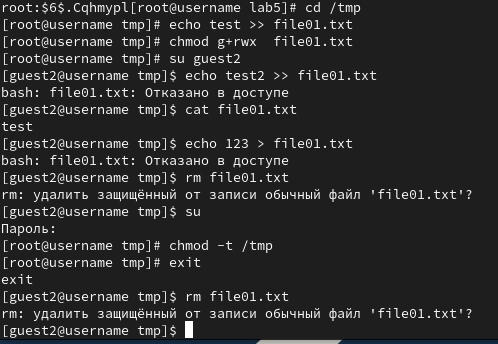

---
## Front matter
lang: ru-RU
title: Лабораторная работа №5
subtitle: Основы информационной безопасности 
author:
  - Галиева Аделина Руслановна
institute:
  - Российский университет дружбы народов, Москва, Россия
date: 04 апреля 2024

## i18n babel
babel-lang: russian
babel-otherlangs: english

## Formatting pdf
toc: false
toc-title: Содержание
slide_level: 2
aspectratio: 169
section-titles: true
theme: metropolis
header-includes:
 - \metroset{progressbar=frametitle,sectionpage=progressbar,numbering=fraction}
 - '\makeatletter'
 - '\beamer@ignorenonframefalse'
 - '\makeatother'
---

## Цели и задачи

Изучение механизмов изменения идентификаторов, применения SetUID- и Sticky-битов. Получение практических навыков работы в консоли с дополнительными атрибутами. Рассмотрение работы механизма смены идентификатора процессов пользователей, а также влияние бита Sticky на запись и удаление файлов.

# Элементы презентации

## Содержание исследования

1. Для выполнения части заданий требуются средства разработки приложений. Проверяем наличие установленного компилятора gcc -v: компилятор обнаружен. 

2. Чтобы система защиты SELinux не мешала выполнению заданий работы, отключили систему запретов до очередной перезагрузки системы командой setenforce 0. 

##

3. Команда getenforce вывела Permissive. 

{#fig:001 width=95%}

##

4. Входим в систему от имени пользователя guest. 

##

5. Создаем команду simpleid.c. 

{#fig:002 width=95%}

##

6. Компилируем программу и убеждаемся, что файл программы создан. 

7. Выполняем программу simpleid. 

##

8. Выполняем системную программу id и gid совпадает в обеих программах. 

{#fig:003 width=95%}

##

9. Усложняем программу, добавив вывод действительных идентификаторов. 

{#fig:004 width=95%}

##

10. Компилируем и запускаем simpleid2.c. 

11. От имени суперпользователя выполняем команды: chown root:guest /home/guest/simpleid2, chmod u+s /home/guest/simpleid2

12. Используем su для повышения прав до суперпользователя. 

##

13. Выполняем проверку правильности установки новых атрибутов и смены владельца файла simpleid2. 

14. Запускаем simpleid2 и id. Результат выполнения программ теперь немного отличается. 

##

15. Проделаем тоже самое относительно SetGID-бита.

{#fig:005 width=95%}

##

16. Создаем программу readfile.c. 

{#fig:006 width=95%}

##

17. Откомпилируем её.  

18. Сменили владельца у файла readfile.c и меняем права так, чтобы только суперпользователь
(root) мог прочитать его, a guest не мог.

19. Проверяем, что пользователь guest не может прочитать файл readfile.c.

##

20. Меняем у программы readfile владельца и установите SetU’D-бит.

21. Проверяем, может ли программа readfile прочитать файл readfile.c.

##

22. Проверяем, может ли программа readfile прочитать файл /etc/shadow.

{#fig:007 width=95%}

##

{#fig:008 width=95%}

23. Выясняем, установлен ли атрибут Sticky на директории /tmp.

24. От имени пользователя guest создаем файл file01.txt в директории /tmp со словом test.

##

25. Просматриваем атрибуты у только что созданного файла и разрешаем чтение и запись для категории пользователей «все остальные». Первоначально все группы имели право на чтение, а запись могли осуществлять все, кроме "остальных пользователей".

26. От пользователя guest2 (не являющегося владельцем) пробуем прочитать файл /tmp/file01.txt.

##

27. От пользователя guest2 пробуем дозаписать в файл /tmp/file01.txt слово test2.

28. Проверяем содержимое файла. В файле теперь записано test test2.

##

29. От пользователя guest2 пробуем записать в файл /tmp/file01.txt слово test3, стерев при этом всю имеющуюся в файле информацию.

30. Проверяем содержимое файла командой cat /tmp/file01.txt.

##

31. От пользователя guest2 пробуем удалить файл /tmp/file01.txt командой rm /tmp/fileOl.txt. Получаем отказ.

32.  От суперпользователя проверили, что атрибута t у директории /tmp нет.

##

33. Повторяем предыдущие шаги. Получилось удалить файл. 

34. Удалось удалить файл от имени пользователя, не являющегося его владельцем.

##

35. Повышаем свои права до суперпользователя и возвращаем атрибут t на директорию /tmp. 

{#fig:009 width=95%}

## Результаты

В ходе выполнения лабораторной работы я изучила механизмы изменения идентификаторов, применения SetUID- и Sticky-битов. Получила практические навыки работы в консоли с дополнительными атрибутами. Рассмотрела работы механизма смены идентификатора процессов пользователей, а также влияние бита Sticky на запись и удаление файлов.

