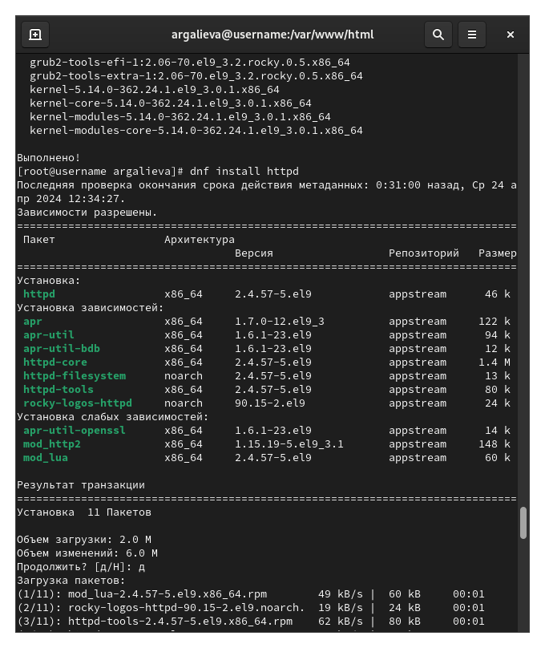
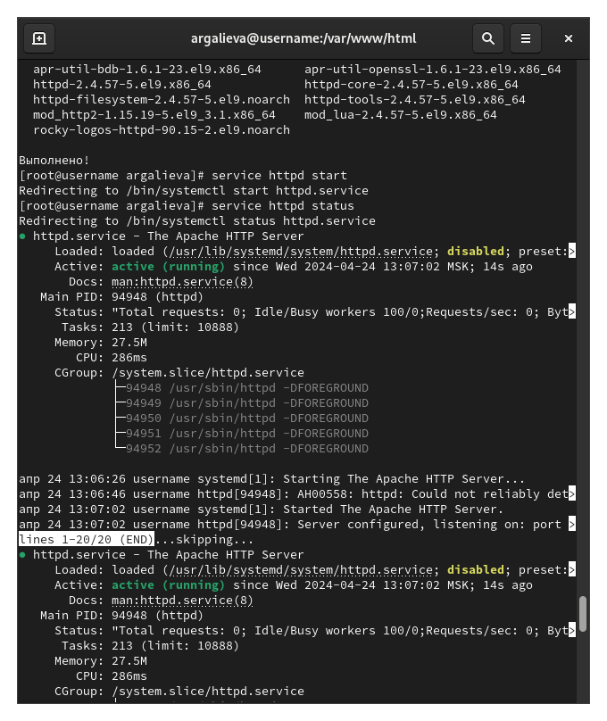
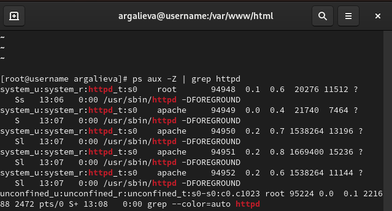
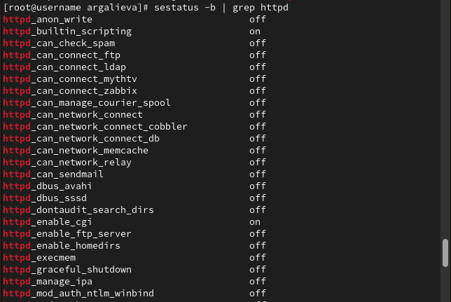
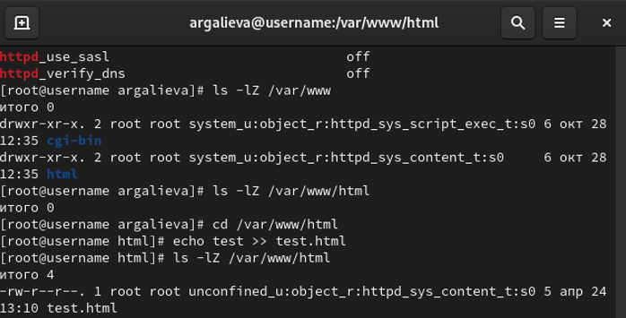
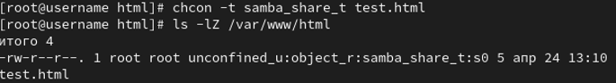
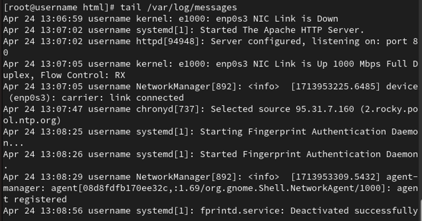
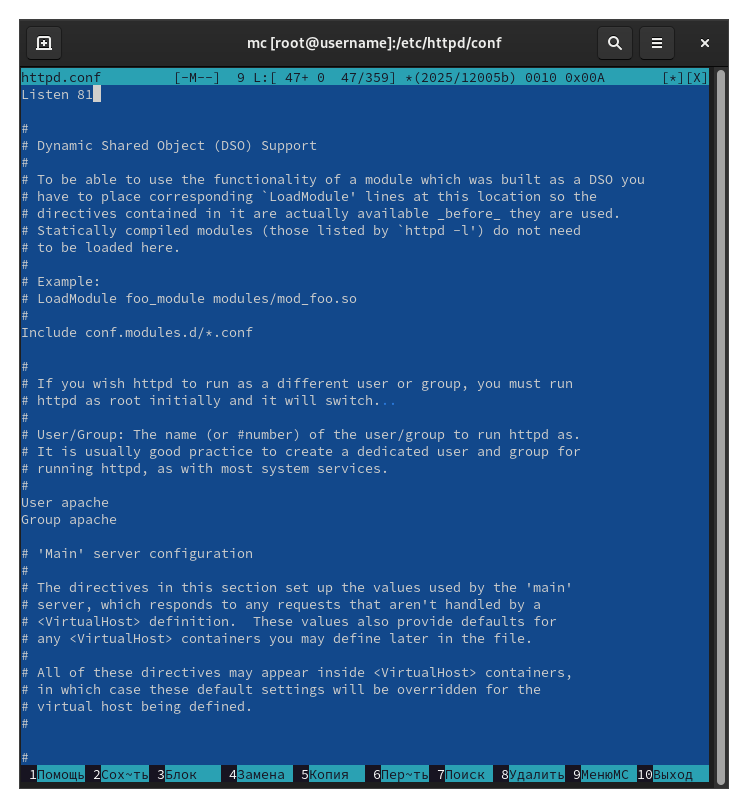
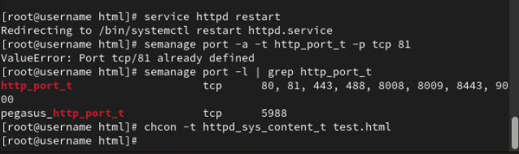

---
## Front matter
lang: ru-RU
title: Основы информационной безопасности
subtitle: Мандатное разграничение прав в Linux
author:
  - Галиева Аделина Руслановна
institute:
  - Российский университет дружбы народов, Москва, Россия
date: 24 апреля 2024

## i18n babel
babel-lang: russian
babel-otherlangs: english

## Formatting pdf
toc: false
toc-title: Содержание
slide_level: 2
aspectratio: 169
section-titles: true
theme: metropolis
header-includes:
 - \metroset{progressbar=frametitle,sectionpage=progressbar,numbering=fraction}
 - '\makeatletter'
 - '\beamer@ignorenonframefalse'
 - '\makeatother'
---

# Вводная часть

## Цели и задачи

Развить навыки администрирования ОС Linux. Получить первое практическое знакомство с технологией SELinux. Проверить работу SELinx на практике совместно с веб-сервером Apache.

# Элементы презентации

## Содержание исследования

1. Устанавливаем httpd. 

2. Задаем имя сервера. 

##

3. Открываем порты для работы с протоколом httpd.

##

{#fig:001 width=95%}

##

{#fig:002 width=95%}

##

4. Входим в систему с полученными учётными данными и убеждаемся, что SELinux работает в режиме enforcing политики targeted с помощью команд getenforce и sestatus.

5. Обращаемся с помощью браузера к веб-серверу, запущенному на вашем компьютере, и убеждаемся, что последний работает: service httpd status или /etc/rc.d/init.d/httpd status.

##

6. Находим веб-сервер Apache в списке процессов, определяем его контекст безопасности и заносим эту информацию в отчёт. Используем команду ps auxZ | grep httpd. 

##

{#fig:003 width=95%}

##

7. Смотрим текущее состояние переключателей SELinux для Apache с помощью команды sestatus -bigrep httpd. Обращаем внимание, что многие из них находятся в положении «off»

##

{#fig:004 width=95%}

##

8. Смотрим статистику по политике с помощью команды seinfo, также определяем множество пользователей, ролей, типов.

9. Определяем тип файлов и поддиректорий, находящихся в директории /var/www, с помощью команды ls -lZ /var/www. В поддиректориях могут располагаться системные скрипты и контент для httpd.

10. Определяем тип файлов, находящихся в директории /var/www/html: ls -lZ /var/www/html. В директории изначально нет файлов. 

##

11. Определяем круг пользователей, которым разрешено создание файлов в директории /var/www/html. Создаем файлы может только root. 

12. Создаем от имени суперпользователя (так как в дистрибутиве после установки только ему разрешена запись директорию) html-файл /var/www/html/test.html следующего содержания:
<html>
<body>test</body>
</html>

13. Проверяем контекст созданного вами файла. Заносим в отчёт контекст, присваиваемый по умолчанию вновь созданным файлам в директории /var/www/html.

##

14. Обращаемся к файлу через веб-сервер, введя в браузере адрес http://127.0.0.1/test.html. Убеждаемся, что файл был успешно отображён. 

##

{#fig:005 width=95%}

##

15. Изучаем справку man httpd_selinux и выясняем, какие контексты файлов определены для httpd. Сопоставляем их с типом файла test.html. Проверяем контекст файла можно командой ls -Z. ls -Z /var/www/html/test.html. Основным контекстом является httpd_sys_content_t, его мы и увидим в выводе команды. 

16. Изменяем контекст файла /var/www/html/test.html с httpd_sys_content_t на любой другой, к которому процесс httpd не должен иметь доступа, например, на samba_share_t: chcon -t samba_share_t /var/www/html/test.html ls -Z /var/www/html/test.html. После этого проверяем, что контекст поменялся. 

##

17. Пробуем ещё раз получить доступ к файлу через веб-сервер, введя в браузере адрес http://127.0.0.1/test.html. Мы должны получить сообщение об ошибке: Forbidden You don't have permission to access /test.html on this server. При изменении контекста файл стал считаться чужим для http и программа не может его прочитать. 

##

{#fig:006 width=95%}

##

18. Проанализируем ситуацию. Почему файл не был отображён, если права доступа позволяют читать этот файл любому пользователю? ls -l /var/www/html/test.html. Просматриваем log-файлы веб-сервера Apache. Также просмотриваем системный лог-файл: tail /var/log/messages. Если в системе окажутся запущенными процессы setroubleshootd и audtd, то вы также сможете увидеть ошибки, аналогичные указанным выше, в файле /var/log/audit/audit.log. Проверяем это утверждение самостоятельно.

##

{#fig:007 width=95%}

##

19. Пробуем запустить веб-сервер Apache на прослушивание ТСР-порта 81 (а не 80, как рекомендует IANA и прописано в /etc/services). Для этого в файле /etc/httpd/httpd.conf находим строчку Listen 80 и заменяем её на Listen 81. 

##

{#fig:008 width=95%}

##

20. Выполняем перезапуск веб-сервера Apache. Произошёл сбой? Сбой не происходит, порт 81 уже вписан в разрешенные. 

21. Проанализируем лог-файлы: tail -nl /var/log/messages. Просматриваем файлы /var/log/http/error_log, /var/log/http/access_log и /var/log/audit/audit.log и выясняем, в каких файлах появились записи.

22. Выполняем команду semanage port -a -t http_port_t -р tcp 81. После этого проверяем список портов командой semanage port -l | grep http_port_t. Убеждаемся, что порт 81 появился в списке.

##

23. Пробуем запустить веб-сервер Apache ещё раз.

24. Возвращаем контекст httpd_sys_cоntent__t к файлу /var/www/html/ test.html: chcon -t httpd_sys_content_t /var/www/html/test.html. После этого пробуем получить доступ к файлу через веб-сервер, введя в браузере адрес http://127.0.0.1:81/test.html. Мы видим содержимое файла — слово «test».

##

{#fig:009 width=95%}

##

25. Исправляем обратно конфигурационный файл apache, вернув Listen 80.
26. Удаляем привязку http_port_t к 81 порту: semanage port -d -t http_port_t -p tcp 81 и проверяем, что порт 81 удалён.
27. Удаляем файл /var/www/html/test.html: rm /var/www/html/test.html.

## Результаты

В ходе выполнения лабораторной работы я развила навыки администрирования ОС Linux. Получила первое практическое знакомство с технологией SELinux. Проверила работу SELinx на практике совместно с веб-сервером Apache.

