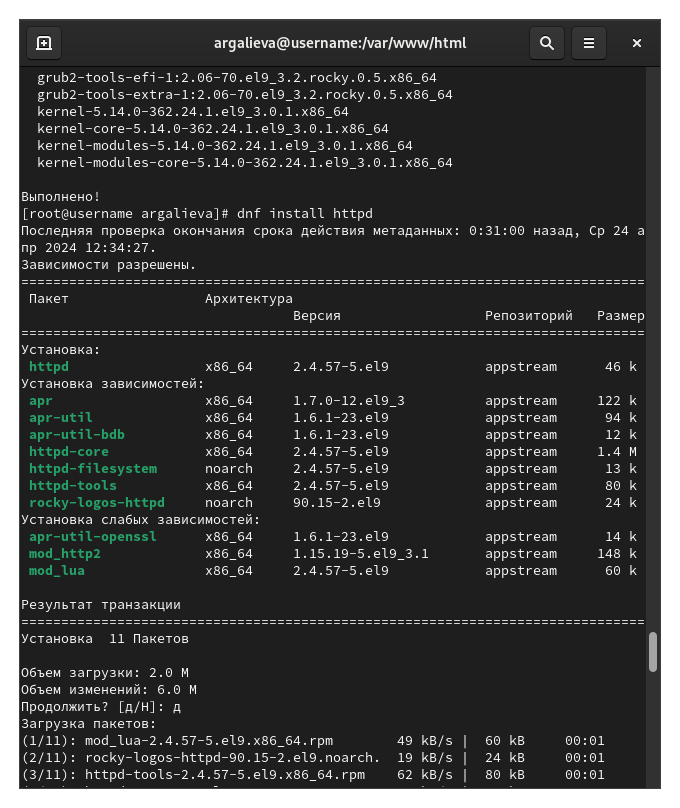
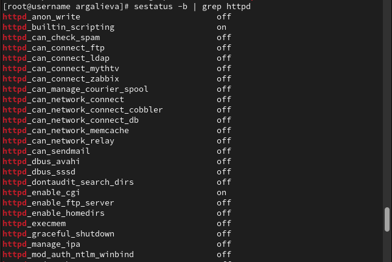
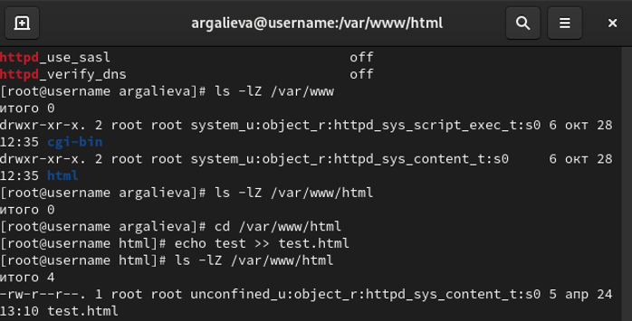
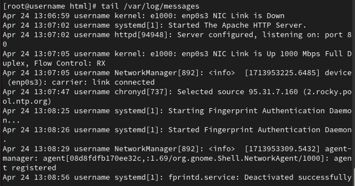
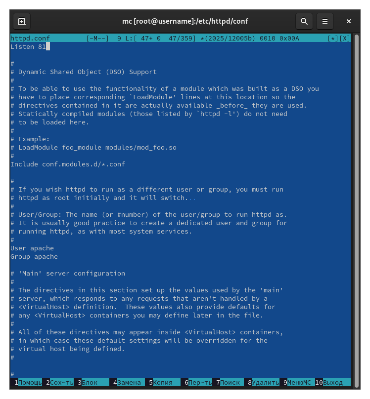

---
## Front matter
title: "Лабораторная работа №6"
subtitle: "Мандатное разграничение прав в Linux."
author: "Галиева Аделина Руслановна"

## Generic otions
lang: ru-RU
toc-title: "Содержание"

## Bibliography
bibliography: bib/cite.bib
csl: pandoc/csl/gost-r-7-0-5-2008-numeric.csl

## Pdf output format
toc: true # Table of contents
toc-depth: 2
lof: true # List of figures
lot: true # List of tables
fontsize: 12pt
linestretch: 1.5
papersize: a4
documentclass: scrreprt
## I18n polyglossia
polyglossia-lang:
  name: russian
  options:
	- spelling=modern
	- babelshorthands=true
polyglossia-otherlangs:
  name: english
## I18n babel
babel-lang: russian
babel-otherlangs: english
## Fonts
mainfont: PT Serif
romanfont: PT Serif
sansfont: PT Sans
monofont: PT Mono
mainfontoptions: Ligatures=TeX
romanfontoptions: Ligatures=TeX
sansfontoptions: Ligatures=TeX,Scale=MatchLowercase
monofontoptions: Scale=MatchLowercase,Scale=0.9
## Biblatex
biblatex: true
biblio-style: "gost-numeric"
biblatexoptions:
  - parentracker=true
  - backend=biber
  - hyperref=auto
  - language=auto
  - autolang=other*
  - citestyle=gost-numeric
## Pandoc-crossref LaTeX customization
figureTitle: "Рис."
tableTitle: "Таблица"
listingTitle: "Листинг"
lofTitle: "Список иллюстраций"
lotTitle: "Список таблиц"
lolTitle: "Листинги"
## Misc options
indent: true
header-includes:
  - \usepackage{indentfirst}
  - \usepackage{float} # keep figures where there are in the text
  - \floatplacement{figure}{H} # keep figures where there are in the text
---

# Цель работы

Развить навыки администрирования ОС Linux. Получить первое практическое знакомство с технологией SELinux. Проверить работу SELinx на практике совместно с веб-сервером Apache.

# Выполнение лабораторной работы

1. Устанавливаем httpd. 

2. Задаем имя сервера. 

3. Открываем порты для работы с протоколом httpd.

{#fig:001 width=95%}

{#fig:002 width=95%}

4. Входим в систему с полученными учётными данными и убеждаемся, что SELinux работает в режиме enforcing политики targeted с помощью команд getenforce и sestatus.

5. Обращаемся с помощью браузера к веб-серверу, запущенному на вашем компьютере, и убеждаемся, что последний работает: service httpd status или /etc/rc.d/init.d/httpd status.

6. Находим веб-сервер Apache в списке процессов, определяем его контекст безопасности и заносим эту информацию в отчёт. Используем команду ps auxZ | grep httpd. 

{#fig:003 width=95%}

7. Смотрим текущее состояние переключателей SELinux для Apache с помощью команды sestatus -bigrep httpd. Обращаем внимание, что многие из них находятся в положении «off»

{#fig:004 width=95%}

8. Смотрим статистику по политике с помощью команды seinfo, также определяем множество пользователей, ролей, типов.

9. Определяем тип файлов и поддиректорий, находящихся в директории /var/www, с помощью команды ls -lZ /var/www. В поддиректориях могут располагаться системные скрипты и контент для httpd.

10. Определяем тип файлов, находящихся в директории /var/www/html: ls -lZ /var/www/html. В директории изначально нет файлов. 

11. Определяем круг пользователей, которым разрешено создание файлов в директории /var/www/html. Создаем файлы может только root. 

12. Создаем от имени суперпользователя (так как в дистрибутиве после установки только ему разрешена запись директорию) html-файл /var/www/html/test.html следующего содержания:
<html>
<body>test</body>
</html>

13. Проверяем контекст созданного вами файла. Заносим в отчёт контекст, присваиваемый по умолчанию вновь созданным файлам в директории /var/www/html.

14. Обращаемся к файлу через веб-сервер, введя в браузере адрес http://127.0.0.1/test.html. Убеждаемся, что файл был успешно отображён. 

{#fig:005 width=95%}

15. Изучаем справку man httpd_selinux и выясняем, какие контексты файлов определены для httpd. Сопоставляем их с типом файла test.html. Проверяем контекст файла можно командой ls -Z. ls -Z /var/www/html/test.html. Основным контекстом является httpd_sys_content_t, его мы и увидим в выводе команды. 

16. Изменяем контекст файла /var/www/html/test.html с httpd_sys_content_t на любой другой, к которому процесс httpd не должен иметь доступа, например, на samba_share_t: chcon -t samba_share_t /var/www/html/test.html ls -Z /var/www/html/test.html. После этого проверяем, что контекст поменялся. 

17. Пробуем ещё раз получить доступ к файлу через веб-сервер, введя в браузере адрес http://127.0.0.1/test.html. Мы должны получить сообщение об ошибке: Forbidden You don't have permission to access /test.html on this server. При изменении контекста файл стал считаться чужим для http и программа не может его прочитать. 

{#fig:006 width=95%}

18. Проанализируем ситуацию. Почему файл не был отображён, если права доступа позволяют читать этот файл любому пользователю? ls -l /var/www/html/test.html. Просматриваем log-файлы веб-сервера Apache. Также просмотриваем системный лог-файл: tail /var/log/messages. Если в системе окажутся запущенными процессы setroubleshootd и audtd, то вы также сможете увидеть ошибки, аналогичные указанным выше, в файле /var/log/audit/audit.log. Проверяем это утверждение самостоятельно.

{#fig:007 width=95%}

19. Пробуем запустить веб-сервер Apache на прослушивание ТСР-порта 81 (а не 80, как рекомендует IANA и прописано в /etc/services). Для этого в файле /etc/httpd/httpd.conf находим строчку Listen 80 и заменяем её на Listen 81. 

{#fig:008 width=95%}

20. Выполняем перезапуск веб-сервера Apache. Произошёл сбой? Сбой не происходит, порт 81 уже вписан в разрешенные. 

21. Проанализируем лог-файлы: tail -nl /var/log/messages. Просматриваем файлы /var/log/http/error_log, /var/log/http/access_log и /var/log/audit/audit.log и выясняем, в каких файлах появились записи.

22. Выполняем команду semanage port -a -t http_port_t -р tcp 81. После этого проверяем список портов командой semanage port -l | grep http_port_t. Убеждаемся, что порт 81 появился в списке.

23. Пробуем запустить веб-сервер Apache ещё раз.

24. Возвращаем контекст httpd_sys_cоntent__t к файлу /var/www/html/ test.html: chcon -t httpd_sys_content_t /var/www/html/test.html. После этого пробуем получить доступ к файлу через веб-сервер, введя в браузере адрес http://127.0.0.1:81/test.html. Мы видим содержимое файла — слово «test».

{#fig:009 width=95%}

25. Исправляем обратно конфигурационный файл apache, вернув Listen 80.
26. Удаляем привязку http_port_t к 81 порту: semanage port -d -t http_port_t -p tcp 81 и проверяем, что порт 81 удалён.
27. Удаляем файл /var/www/html/test.html: rm /var/www/html/test.html.

# Выводы

В ходе выполнения лабораторной работы я развила навыки администрирования ОС Linux. Получила первое практическое знакомство с технологией SELinux. Проверила работу SELinx на практике совместно с веб-сервером Apache.

