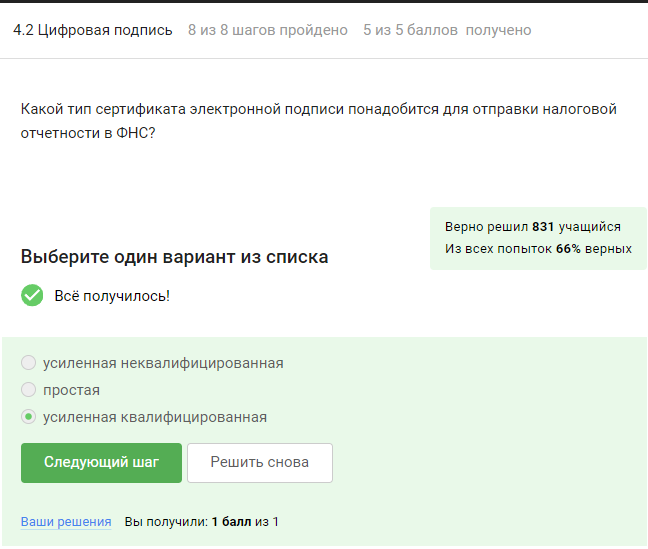

---
## Front matter
title: "Внешний курс"
subtitle: "Основы кибербезопасности"
author: "Галиева Аделина Руслановна"

## Generic otions
lang: ru-RU
toc-title: "Содержание"

## Bibliography
bibliography: bib/cite.bib
csl: pandoc/csl/gost-r-7-0-5-2008-numeric.csl

## Pdf output format
toc: true # Table of contents
toc-depth: 2
lof: true # List of figures
lot: true # List of tables
fontsize: 12pt
linestretch: 1.5
papersize: a4
documentclass: scrreprt
## I18n polyglossia
polyglossia-lang:
  name: russian
  options:
	- spelling=modern
	- babelshorthands=true
polyglossia-otherlangs:
  name: english
## I18n babel
babel-lang: russian
babel-otherlangs: english
## Fonts
mainfont: PT Serif
romanfont: PT Serif
sansfont: PT Sans
monofont: PT Mono
mainfontoptions: Ligatures=TeX
romanfontoptions: Ligatures=TeX
sansfontoptions: Ligatures=TeX,Scale=MatchLowercase
monofontoptions: Scale=MatchLowercase,Scale=0.9
## Biblatex
biblatex: true
biblio-style: "gost-numeric"
biblatexoptions:
  - parentracker=true
  - backend=biber
  - hyperref=auto
  - language=auto
  - autolang=other*
  - citestyle=gost-numeric
## Pandoc-crossref LaTeX customization
figureTitle: "Рис."
tableTitle: "Таблица"
listingTitle: "Листинг"
lofTitle: "Список иллюстраций"
lotTitle: "Список таблиц"
lolTitle: "Листинги"
## Misc options
indent: true
header-includes:
  - \usepackage{indentfirst}
  - \usepackage{float} # keep figures where there are in the text
  - \floatplacement{figure}{H} # keep figures where there are in the text
---

# Цель работы

Изучить основы кибербезопасности. 

# Прохождение курса

1. Введение в курс

# Безопасность в сети

2. 1. Как работает интернет: базовые сетевые протоколы.

{#fig:001 width=95%}

{#fig:002 width=95%}

{#fig:003 width=95%}

{#fig:004 width=95%}

{#fig:005 width=95%}

{#fig:006 width=95%}

{#fig:007 width=95%}

{#fig:008 width=95%}

{#fig:009 width=95%}

2. 2. Персонализация сети.

{#fig:010 width=95%}

{#fig:011 width=95%}

{#fig:012 width=95%}

{#fig:013 width=95%}

2. 3.  Браузер TOR. Анимация.

{#fig:014 width=95%}

{#fig:015 width=95%}

{#fig:016 width=95%}

{#fig:017 width=95%}

2. 4. Беспроводные сети Wi-Fi.

{#fig:018 width=95%}

{#fig:019 width=95%}

{#fig:020 width=95%}

{#fig:021 width=95%}

{#fig:022 width=95%}

# Защита ПК/телефона

3. 1. Шифрование диска. 

{#fig:023 width=95%}

{#fig:024 width=95%}

{#fig:025 width=95%}

3. 2. Пароли. 

{#fig:026 width=95%}

{#fig:027 width=95%}

{#fig:028 width=95%}

{#fig:029 width=95%}

{#fig:030 width=95%}

{#fig:031 width=95%}

3. 3. Фишинг. 

{#fig:032 width=95%}

{#fig:033 width=95%}

3. 4. Вирусы. Примеры. 

{#fig:034 width=95%}

{#fig:035 width=95%}

3. 5. Безопасность мессенджеров.

{#fig:036 width=95%}

{#fig:037 width=95%}

# Криптография на практике

4. 1. Введение в криптографию. 

{#fig:038 width=95%}

{#fig:039 width=95%}

{#fig:040 width=95%}

{#fig:041 width=95%}

{#fig:042 width=95%}

4. 2. Цифровая подпись. 

{#fig:043 width=95%}

{#fig:044 width=95%}

{#fig:045 width=95%}

{#fig:046 width=95%}

{#fig:047 width=95%}

4. 3. Электронные платежи.

{#fig:048 width=95%}

{#fig:049 width=95%}

{#fig:050 width=95%}

4. 4. Блокчейн. 

{#fig:051 width=95%}

{#fig:052 width=95%}

{#fig:053 width=95%}

# Выводы 

Сертификат не выдается.

{#fig:054 width=95%}

