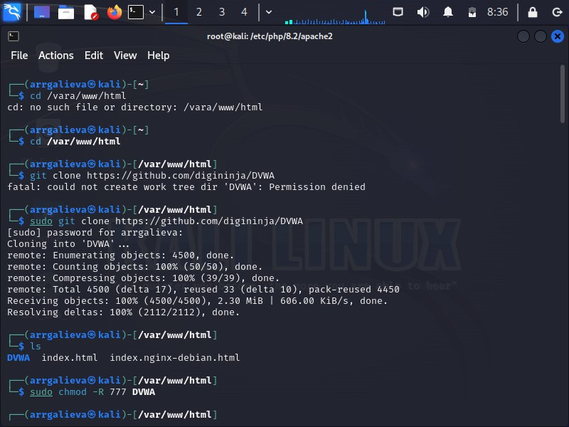
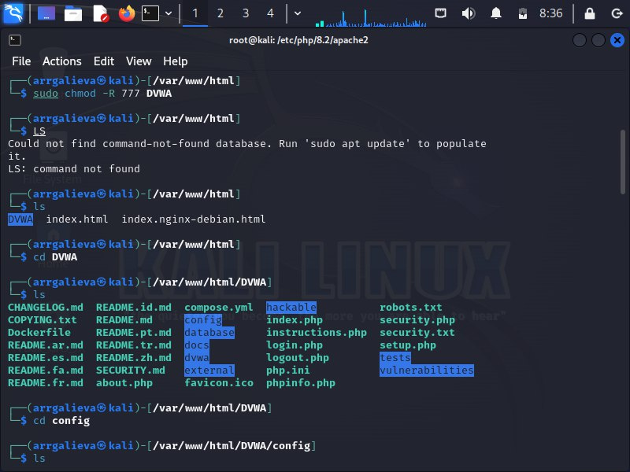
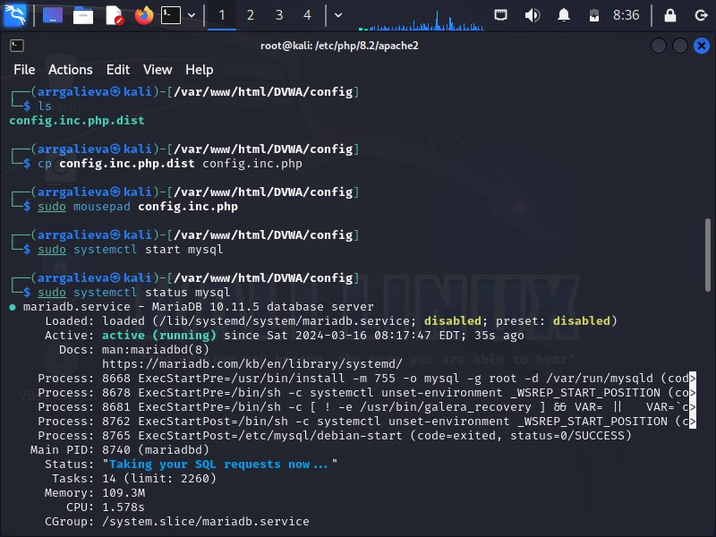
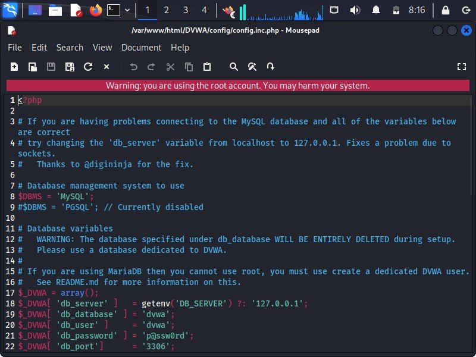
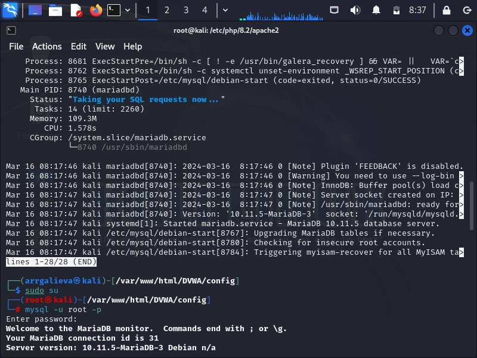
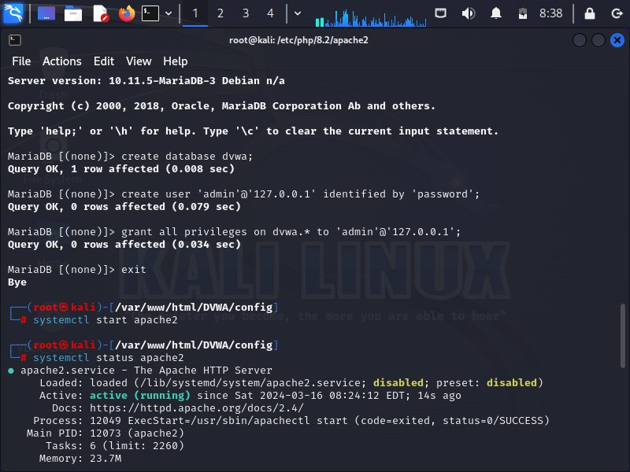
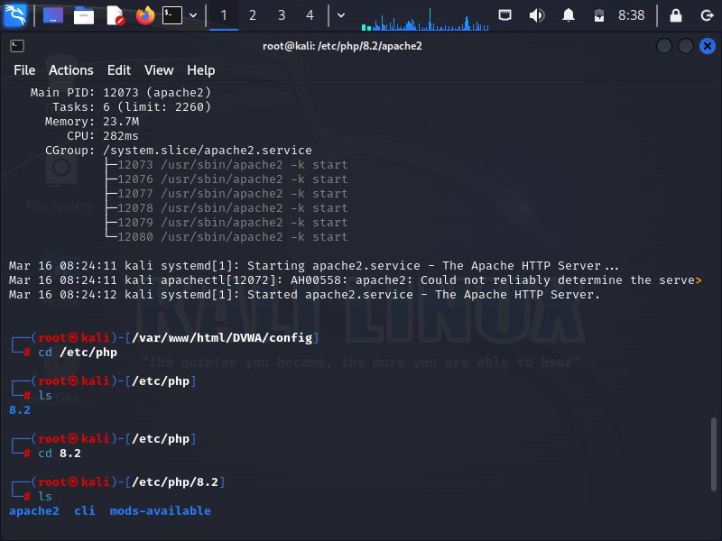
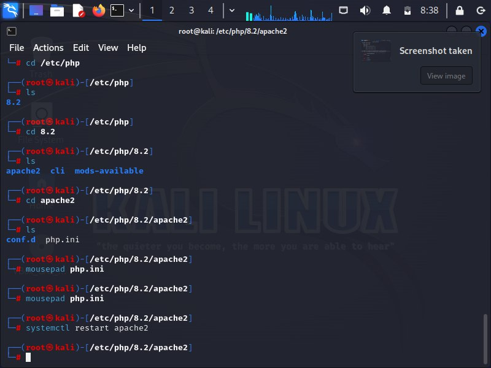
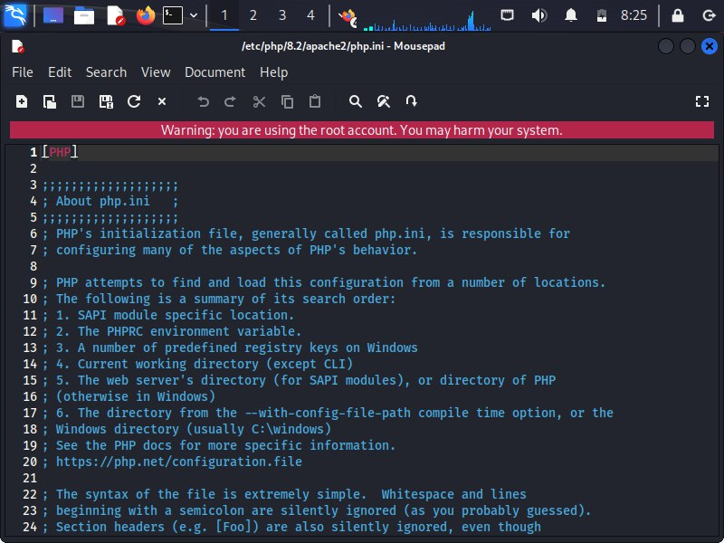
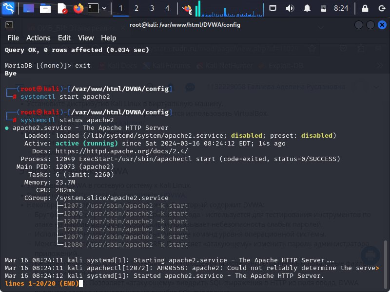

---
## Front matter
lang: ru-RU
title: Индивидуальный проект
subtitle: Основы информационной безопасности 
author:
  - Галиева Аделина Руслановна
institute:
  - Российский университет дружбы народов, Москва, Россия
date: 16 марта 2024

## i18n babel
babel-lang: russian
babel-otherlangs: english

## Formatting pdf
toc: false
toc-title: Содержание
slide_level: 2
aspectratio: 169
section-titles: true
theme: metropolis
header-includes:
 - \metroset{progressbar=frametitle,sectionpage=progressbar,numbering=fraction}
 - '\makeatletter'
 - '\beamer@ignorenonframefalse'
 - '\makeatother'
---


# Вводная часть

## Цели и задачи

Установить DVWA в гостевую систему к Kali Linux.

## Материалы и методы

- Процессор `pandoc` для входного формата Markdown
- Результирующие форматы
	- `pdf`
	- `html`
- Автоматизация процесса создания: `Makefile`

# Создание презентации

## Процессор `pandoc`

- Pandoc: преобразователь текстовых файлов
- Сайт: <https://pandoc.org/>
- Репозиторий: <https://github.com/jgm/pandoc>

## Формат `pdf`

- Использование LaTeX
- Пакет для презентации: [beamer](https://ctan.org/pkg/beamer)
- Тема оформления: `metropolis`

## Код для формата `pdf`

```yaml
slide_level: 2
aspectratio: 169
section-titles: true
theme: metropolis
```

## Формат `html`

- Используется фреймворк [reveal.js](https://revealjs.com/)
- Используется [тема](https://revealjs.com/themes/) `beige`

## Код для формата `html`

- Тема задаётся в файле `Makefile`

```make
REVEALJS_THEME = beige 
```
# Результаты

## Получающиеся форматы

- Полученный `pdf`-файл можно демонстрировать в любой программе просмотра `pdf`
- Полученный `html`-файл содержит в себе все ресурсы: изображения, css, скрипты

# Элементы презентации

## Содержание исследования

1. Устанавливаем DVWA при помощи различных команд и данного нам репозитория. 

{#fig:001 width=95%}

##

{#fig:002 width=95%}

##

{#fig:003 width=95%}

##


{#fig:004 width=95%}

##

{#fig:005 width=95%}

##

{#fig:006 width=95%}


##
{#fig:007 width=95%}

##

{#fig:008 width=95%}

##

{#fig:009 width=95%}

##

{#fig:010 width=95%}


## Результаты

В ходе выполнения данного этапа я установила DVWA в гостевую систему к Kali Linux.


